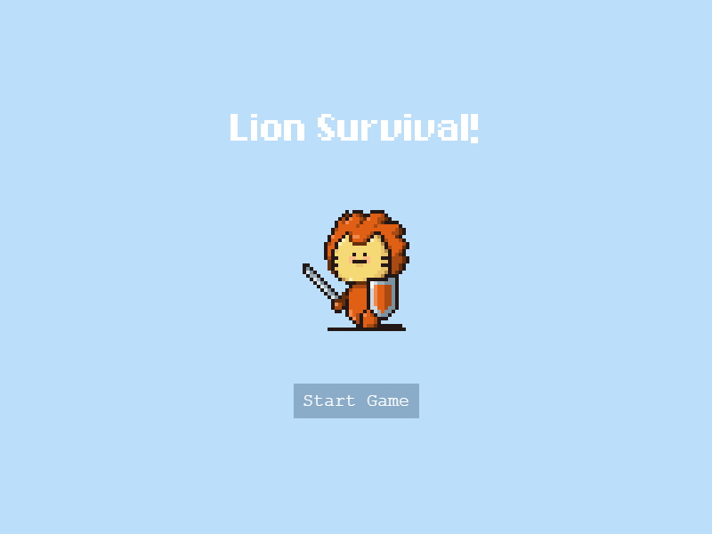

# lion-survival

Phaser3 기반의 브라우저 로그라이크 서바이벌 게임. 끝없이 몰려드는 몬스터를 피하고, 경험치를 쌓아 성장하며, 보스를 처치해 클리어하세요.

[](assets/screenshots/hero-title.png)

## 게임 방법

`↑` `↓` `←` `→` 이동, `ESC` 일시정지, `ENTER` 시작. 무기는 자동 공격합니다.

## 시작하기

```bash
npm install && npm start
```

## 라이선스

[MIT 라이선스](LICENSE)로 배포됩니다.
