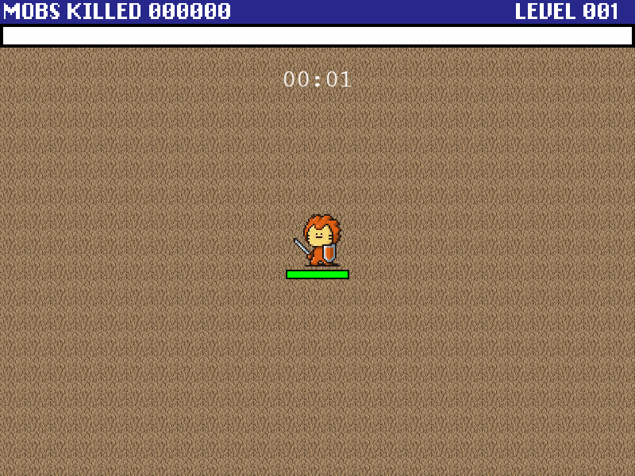

# Lion Survival!

Phaser3 기반의 브라우저 로그라이크 서바이벌 게임.  
끝없이 몰려드는 몬스터를 피하고, 경험치를 쌓아 성장하며, 보스를 처치해 클리어하세요.

<p align="center">
  
</p>

## 게임 방법

| 키 | 동작 |
|---|---|
| `↑` `↓` `←` `→` | 캐릭터 이동 |
| `ENTER` | 게임 시작 |
| `ESC` | 일시정지 |

무기는 자동으로 공격합니다.

## 시작하기

```bash
npm install && npm start
```

브라우저에서 `http://localhost:8080` 으로 접속합니다.

## 라이선스

[MIT 라이선스](LICENSE)로 배포됩니다.